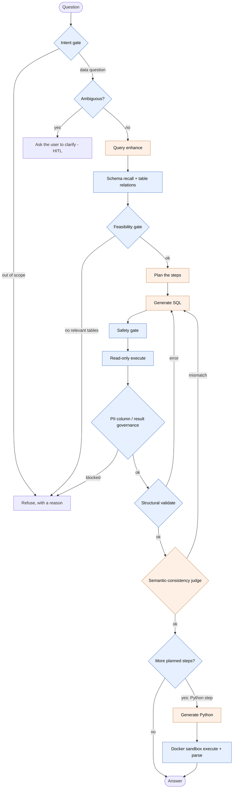

# Cadence

> **A reliability-first natural-language-to-SQL data agent — and the evaluation harness that
> measures it, and is willing to reject its own regressions.**

Most NL→SQL demos ask you to *trust* the model. Cadence is built so you can *verify* it:
deterministic guardrails you can audit, a pipeline that refuses (with a reason) instead of
guessing, and a self-built harness that measures how reliable selected parts are — including
where they aren't.

Architecture informed by studying Alibaba's `spring-ai-alibaba/DataAgent` (no code copied).
Cadence builds on a DB-agnostic core ported from my earlier DataPilot project; its
planner-driven orchestration, Docker sandbox, and current reliability surfaces were developed
here. Implemented in Python / LangGraph.

---

## The problem it takes seriously

For a data agent, the dangerous failure isn't a missing answer — it's a **confident wrong
number**. A KPI that looks reasonable but silently dropped a `JOIN` or a `WHERE` clause ends
up in a weekly report and drives a decision. In 2026, capable agents are not scarce; agents
whose reliability you can actually *measure* are. Cadence is an attempt to move "can I trust
this number?" from faith toward measurement.

## What it is (and isn't)

- **It is:** a reliability-first data-agent engineering testbed on a demo SaaS-metrics
  schema, with a first-class evaluation and reliability harness.
- **It isn't (yet):** a multi-tenant, production enterprise data platform. There is no
  cross-warehouse identity, row-level access control, or schema/version lifecycle. Those
  boundaries are known and deliberate — see [Status & roadmap](#status--roadmap).

## How it works

The agent is a bounded LangGraph state machine. The design choice that matters: **the
enforceable reliability invariants — read-only execution, PII-column/result governance
routing, bounded retries, and the sandbox boundary — come from a deterministic backbone that
never depends on the LLM behaving, so they can't inherit the model's blind spots.**
Determinism makes these invariants auditable; it does not by itself make every gating
*decision* correct — that's what the harness measures. Five stages *are* LLM-backed (query
understanding, planning, SQL generation, the semantic-consistency judge, and Python-program
generation); the rest is auditable deterministic code.



<sub>Blue = deterministic, auditable rules · Orange = LLM-backed. Simplified: the graph also
drives a bounded repair loop. A plan is a single SQL step, optionally followed by one Python
analysis step.</sub>

Key design choices, each meant to be defensible rather than impressive:

- **Deterministic skeleton.** The SQL safety gate (read-only only; blocks `ATTACH`/`PRAGMA`
  side effects), PII-column/result governance, and the execution-match oracle are plain code.
  The SQL and Python they check are model-generated, but **the checks, limits, and sandbox
  boundary don't rely on the model behaving.**
- **Reasoned refusal + bounded self-correction.** Out-of-scope or unanswerable questions are
  refused with a reason, not hallucinated; a failed SQL is fed back for a bounded repair
  loop; ambiguous questions trigger a clarification (human-in-the-loop).
- **Governance topology.** A result blocked by PII-column/result governance can never reach
  the LLM judge or the Python step — the graph routes around it structurally.
- **The LLM judge is explicitly a *soft* layer.** It shares a model (and therefore blind
  spots) with the generator, so it is not treated as a trusted oracle — it's a best-effort
  additional defense, and the harness measures how soft it actually is.

## The differentiator: a harness that can reject its own changes

Cadence's headline is not the agent — it's the **self-built evaluation & reliability
harness**, and the engineering discipline around it.

Reliability is decomposed into three quantifiable surfaces:

| Surface | What it evaluates | Tier |
| --- | --- | --- |
| **gate** | Routing decisions (refuse vs. proceed), per-gate precision/recall | Deterministic · CI |
| **consistency** | The semantic-consistency judge: catch-rate on wrong SQL, false-positive-rate on correct SQL | Real-API · manual |
| **sandbox** | The Python analysis step: does the generated program compute the right answer | Real-API + Docker · manual |

The methodology is the point:

- **Adversarial cases *paired with clean controls*** — so a high catch-rate can't hide the
  fact that the check is just trigger-happy.
- **Deterministic "teeth" kept separate from measured rates** — a hand-labeled fixture that
  matches the code is `by_construction`, never reported as a measured accuracy.
- **Provenance on every real run** — golden-set SHA-256, per-case outcomes, model, timestamp
  — so two runs are comparable.
- **Pre-registration and negative results allowed.** A change is proposed, acceptance criteria
  are locked, fixtures are frozen and hashed, *then* it's measured.

This last point produced the work I'm most proud of: two plausible, locally-good-looking
improvements to the judge (feeding it a schema catalog; tightening its prompt) were both
**rejected by the pre-registered evaluation** — the catalog showed no measured value, and the
tightening bought recall at the cost of falsely refusing a legitimate query, which the clean
controls caught. Both were reverted; the judge prompt is byte-identical to the baseline. The
conditions, fixture hash, sample size, and conclusions are recorded in
[`docs/reliability/2026-07-22-judge-entity-experiment.md`](docs/reliability/2026-07-22-judge-entity-experiment.md).
**Building a mechanism that can veto your own plausible ideas is closer to real reliability
engineering than adding another node.**

## Running it

```bash
# install (editable, with dev extras)
pip install -e ".[dev]"

# run the agent on a question (needs DEEPSEEK_API_KEY in the environment / a local .env)
python -m agent "How many active subscriptions do we have per region?"

# retrieval-only health check: no LLM / API key required
# (first use may download the embedding model, then it's cached)
python -m agent --retrieval-only "revenue by plan"

# the deterministic scorecard tier: zero API, zero Docker, CI-enforced
python -m evals.scorecard --tier deterministic

# the full two-tier scorecard (needs DEEPSEEK_API_KEY + local Docker sandbox image)
docker build -t cadence-sandbox:latest - < Dockerfile.sandbox
python -m evals.scorecard --tier all

# tests (service-free: LLM and Docker are faked in CI)
pytest -q
```

## Status & roadmap

- **307 tests** pass. Service-free unit tests (faked LLM/Docker) run in CI; the catch-rate /
  match-rate numbers are only produced by the manual real-API tier.
- Real-API scorecards are honest **single-run point estimates on a small demo schema** —
  recorded with provenance, deliberately *not* dressed up as stable capabilities.

Next, in priority order:

1. **External validity** — run the E2E path on a frozen, auditable slice of a public
   benchmark (BIRD / Spider), instead of only the in-repo development fixtures.
2. **A full-agent end-to-end surface with failure attribution** — the outcome a user actually
   cares about (right answer / right refusal / no governance leak), with failures decomposed
   across retrieval → planning → SQL → judge → sandbox.
3. **A verifiable semantic layer** — extend the existing metric registry
   (`agent/semantic_layer.py`) into a declarative entity/relationship/metric contract, so an
   alias like `customer → account` comes from a manifest rather than a model's guess.

## Tech

Python 3.11 · LangGraph · DeepSeek (`deepseek-chat`, factory-isolated) · sqlglot · fastembed
(hybrid lexical + embedding retrieval) · SQLite · Docker (isolated Python sandbox) · pytest + CI.
