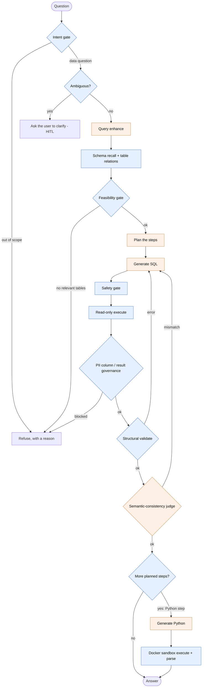

# Cadence

[](https://github.com/niguang220/cadence/actions/workflows/ci.yml)

> **A reliability-first natural-language-to-SQL data agent — and the evaluation harness that
> measures it, and is willing to reject its own regressions.**

Most NL→SQL demos ask you to *trust* the model. Cadence is built so you can *verify* it:
deterministic guardrails you can audit, a pipeline that refuses (with a reason) instead of
guessing, and a self-built harness that measures how reliable selected parts are — including
where they aren't.

Cadence continues my earlier **DataPilot** project and reuses its DB-agnostic core; the
planner-driven orchestration, the retrieval pipeline, the Docker sandbox, and every
reliability surface described below were built here. The planner/gate topology draws on ideas
from reading Alibaba's `spring-ai-alibaba/DataAgent` — chiefly the separation of schema recall
from feasibility gating. Python / LangGraph.

---

## The problem it takes seriously

For a data agent, the dangerous failure isn't a missing answer — it's a **confident wrong
number**. A KPI that looks reasonable but silently dropped a `JOIN` or a `WHERE` clause ends
up in a weekly report and drives a decision. In 2026, capable agents are not scarce; agents
whose reliability you can actually *measure* are. Cadence is an attempt to move "can I trust
this number?" from faith toward measurement.

## What it is (and isn't)

- **It is:** a reliability-first data-agent engineering testbed on a demo SaaS-metrics
  schema, with a first-class evaluation and reliability harness.
- **It isn't (yet):** a multi-tenant, production enterprise data platform. There is no
  cross-warehouse identity, row-level access control, or schema/version lifecycle. Those
  boundaries are known and deliberate — see [Status & roadmap](#status--roadmap).

## How it works

The agent is a bounded LangGraph state machine. The design choice that matters: **the
enforceable reliability invariants — read-only execution, PII-column/result governance
routing, bounded retries, and the sandbox boundary — come from a deterministic backbone that
never depends on the LLM behaving, so they can't inherit the model's blind spots.**
Determinism makes these invariants auditable; it does not by itself make every gating
*decision* correct — that's what the harness measures. Five stages *are* LLM-backed (query
understanding, planning, SQL generation, the semantic-consistency judge, and Python-program
generation); the rest is auditable deterministic code.


```mermaid
flowchart TB
  Q([Question]) --> INT{Intent gate}
  INT -->|out of scope| REF[Refuse, with a reason]
  INT -->|data question| CLR{Ambiguous?}
  CLR -->|yes| ASK[Ask the user to clarify - HITL]
  CLR -->|no| ENH[Query enhance]
  ENH --> RECALL[Schema recall + table relations]
  RECALL --> FEAS{Feasibility gate}
  FEAS -->|no relevant tables| REF
  FEAS -->|ok| PLAN[Plan the steps]
  PLAN --> GEN[Generate SQL]
  GEN --> SAFE[Safety gate]
  SAFE --> EXEC[Read-only execute]
  EXEC --> GOV{PII column / result governance}
  GOV -->|blocked| REF
  GOV -->|ok| VAL{Structural validate}
  VAL -->|error| GEN
  VAL -->|ok| JUDGE{Semantic-consistency judge}
  JUDGE -->|mismatch| GEN
  JUDGE -->|ok| STEP{More planned steps?}
  STEP -->|no| ANS([Answer])
  STEP -->|yes: Python step| PYGEN[Generate Python]
  PYGEN --> PYEXEC[Docker sandbox execute + parse]
  PYEXEC --> ANS

  classDef det fill:#e6f0ff,stroke:#4a78c2,color:#111;
  classDef llm fill:#fff0e6,stroke:#c2884a,color:#111;
  class INT,CLR,RECALL,FEAS,SAFE,EXEC,GOV,VAL,STEP,PYEXEC det;
  class ENH,PLAN,GEN,JUDGE,PYGEN llm;
```

<sub>Blue = deterministic, auditable rules · Orange = LLM-backed. Simplified: the graph also
drives a bounded repair loop. A plan is a single SQL step, optionally followed by one Python
analysis step.</sub>

Key design choices, each meant to be defensible rather than impressive:

- **Deterministic skeleton.** The SQL safety gate (read-only only; blocks `ATTACH`/`PRAGMA`
  side effects), PII-column/result governance, and the execution-match oracle are plain code.
  The SQL and Python they check are model-generated, but **the checks, limits, and sandbox
  boundary don't rely on the model behaving.**
- **Reasoned refusal + bounded self-correction.** Out-of-scope or unanswerable questions are
  refused with a reason, not hallucinated; a failed SQL is fed back for a bounded repair
  loop; ambiguous questions trigger a clarification (human-in-the-loop).
- **Governance topology.** A result blocked by PII-column/result governance can never reach
  the LLM judge or the Python step — the graph routes around it structurally.
- **The LLM judge is explicitly a *soft* layer.** It shares a model (and therefore blind
  spots) with the generator, so it is not treated as a trusted oracle — it's a best-effort
  additional defense, and the harness measures how soft it actually is.

## The differentiator: a harness that can reject its own changes

Cadence's headline is not the agent — it's the **self-built evaluation & reliability
harness**, and the engineering discipline around it.

Reliability is decomposed into three quantifiable surfaces:

| Surface | What it evaluates | Tier |
| --- | --- | --- |
| **gate** | Routing decisions (refuse vs. proceed), per-gate precision/recall | Deterministic · CI |
| **consistency** | The semantic-consistency judge: catch-rate on wrong SQL, false-positive-rate on correct SQL | Real-API · manual |
| **sandbox** | The Python analysis step: does the generated program compute the right answer | Real-API + Docker · manual |

The methodology is the point:

- **Adversarial cases *paired with clean controls*** — so a high catch-rate can't hide the
  fact that the check is just trigger-happy.
- **Deterministic "teeth" kept separate from measured rates** — a hand-labeled fixture that
  matches the code is `by_construction`, never reported as a measured accuracy.
- **Provenance on every real run** — golden-set SHA-256, per-case outcomes, model, timestamp
  — so two runs are comparable.
- **Pre-registration and negative results allowed.** A change is proposed, acceptance criteria
  are locked, fixtures are frozen and hashed, *then* it's measured.

This last point produced the work I'm most proud of: two plausible, locally-good-looking
improvements to the judge (feeding it a schema catalog; tightening its prompt) were both
**rejected by the pre-registered evaluation** — the catalog showed no measured value, and the
tightening bought recall at the cost of falsely refusing a legitimate query, which the clean
controls caught. Both were reverted; the judge prompt is byte-identical to the baseline. The
conditions, fixture hash, sample size, and conclusions are recorded in
[`docs/reliability/2026-07-22-judge-entity-experiment.md`](docs/reliability/2026-07-22-judge-entity-experiment.md).
**Building a mechanism that can veto your own plausible ideas is closer to real reliability
engineering than adding another node.**

## Measured: a full-agent E2E with failure attribution

The harness above measures components. This one measures the whole agent, against real
infrastructure, and attributes each failure to a stage.

A rank-sensitive value-linking golden was frozen before running — spec SHA
`f9c4d8cb140a4b109b2a388798d117a0fa9cb983fa126c78d5333df65a9a1ebb`, covering case id,
question, gold SQL and required tables, so the golden cannot silently drift under the
numbers. 10 primaries × 4 retrieval configs × 5 repeats, plus 4 controls = **280 records**
against **real Elasticsearch 8.19 and real DeepSeek**.

**Read the numbers with the fixture in mind.** The set was deliberately built to be
*non-saturated* — cases where neither lexical nor dense retrieval has a bridge to the answer.
It measures the value channel's marginal contribution on its hardest ground. It is not an
overall accuracy score, and a number like 60% means something entirely different here than it
would on a benchmark chosen to be representative.

| config | exec_match | candidate recall | Fusion@5 |
| --- | --- | --- | --- |
| lexical | 28% | 0.20 | 0.20 |
| dense (rrf) | 24% | 0.40 | 0.30 |
| lexical + value | 48% | 0.60 | 0.60 |
| dense + value | **60%** | **0.80** | **0.75** |

What the harness separated — which is the actual point:

- **Value converts retrieval misses into execution wins** in three categories, including one
  combo-only case: value alone 0/5, dense alone 0/5, the two together 5/5.
- **Two Chinese cases returned an empty candidate set in that run — root cause unknown.**
  `zh_shyuntu_tickets` and `zh_tianhe_contracts` sat at candidate recall 0.00 under every
  config, so the agent refused rather than guessed. A follow-up stood up real Elasticsearch
  8.19 and **disproved** the first hypothesis (a "CJK tokenisation gap"): on fresh, rebuilt,
  and reused indexes real ES tokenises those names and returns `exact_keyword` hits identical
  to `FakeValueBackend`. What the investigation *did* confirm is a real defect —
  `ElasticsearchValueBackend` never checked the `_bulk` response's per-item `errors`, so a
  partial ingestion failure could silently drop documents (now fixed: ingestion fails loud).
  Whether that is what bit the historical run is not recoverable from the logs, so the
  280-run cause stays **unknown** rather than claimed.
- **Retrieval-fine / generation-fails** cases isolated as a generation problem (recall 1.0,
  wrong SQL every repeat), out of scope for anything retrieval-side.
- Controls: 80 runs, **zero PII leak**, zero silent backend fallback, and a full-blob scan of
  the artifacts clean of raw entity values.

**The recommendation this produced was to ship nothing.** The shipping preset was never in
the comparison set, so the run cannot claim `dense+value` beats it; the exec-level lift is
real but narrow; and the wins concentrate in exactly the niche the value channel was built
for. The report proposes a head-to-head canary instead of a default flip, and the production
default is unchanged.
[Full report with per-case results, stage events, and cost](docs/reliability/2026-08-11-stage3a-value-e2e-280.md).

## Running it

```bash
# install (editable, with dev extras)
pip install -e ".[dev]"

# run the agent on a question (needs DEEPSEEK_API_KEY in the environment / a local .env)
python -m agent "How many active subscriptions do we have per region?"

# retrieval-only health check: no LLM / API key required
# (first use may download the embedding model, then it's cached)
python -m agent --retrieval-only "revenue by plan"

# the deterministic scorecard tier: zero API, zero Docker, CI-enforced
python -m evals.scorecard --tier deterministic

# the full two-tier scorecard (needs DEEPSEEK_API_KEY + local Docker sandbox image)
docker build -t cadence-sandbox:latest - < Dockerfile.sandbox
python -m evals.scorecard --tier all

# tests (service-free: LLM and Docker are faked in CI)
pytest -q

# a local, reliability-forward demo (Streamlit): shows the SQL, the pipeline trace, and
# the semantic layer ON vs OFF -- all from real agent runs, nothing hard-coded
pip install -e ".[demo]"
streamlit run demo/app.py
```

## Example

A real session against the built-in demo schema (`python -m agent "<question>"`):

```text
$ python -m agent "What is our total MRR from active subscriptions?"
tables: ['subscription', 'mrr_movement', 'revenue_recognition', 'invoice', 'plan']
SQL:    SELECT SUM(mrr) AS total_mrr
        FROM subscription
        WHERE (ended_on IS NULL OR ended_on >= date('now', 'start of month'))
          AND started_on < date('now', 'start of month', '+1 month');
answer: total_mrr: 2328.0

$ python -m agent "What's the weather in Singapore today?"
tables: []
answer: No tables look relevant to this question.
```

The first question is understood, translated to safe read-only SQL, executed, and answered.
The second is outside what the data can answer — so the agent refuses with a reason instead
of inventing a number.

## Status & roadmap

- **314 tests** pass. Service-free unit tests (faked LLM/Docker) run in CI; the catch-rate /
  match-rate numbers are only produced by the manual real-API tier.
- Real-API scorecards are honest **single-run point estimates on a small demo schema** —
  recorded with provenance, deliberately *not* dressed up as stable capabilities.

Next, in priority order:

1. **A head-to-head canary against the shipping preset** — `current_hybrid + value` measured
   against `current_hybrid` on the same frozen set. That comparison, not the one already run,
   is what a default flip would actually require. This is the one live follow-up the E2E
   generated: the earlier "CJK retrieval gap" lead was investigated and **disproved** (see the
   value-E2E bullet above), and the real defect it surfaced — unchecked ES bulk errors that
   could silently drop documents — is fixed, so no analyzer work is warranted.
3. **External validity** — run the E2E path on a frozen, auditable slice of a public
   benchmark (BIRD / Spider), instead of only in-repo fixtures.
4. **A verifiable semantic layer** — extend the existing metric registry
   (`agent/semantic_layer.py`) into a declarative entity/relationship/metric contract, so an
   alias like `customer → account` comes from a manifest rather than a model's guess.

## Tech

Python 3.11 · LangGraph · DeepSeek (`deepseek-chat`, factory-isolated) · sqlglot · fastembed
(hybrid lexical + embedding retrieval) · Elasticsearch 8 (opt-in value-linking channel,
`pip install -e ".[es]"`) · SQLite · Docker (isolated Python sandbox) · pytest + CI, with an
opt-in real-Elasticsearch integration tier.

## License

MIT — see [LICENSE](LICENSE).
