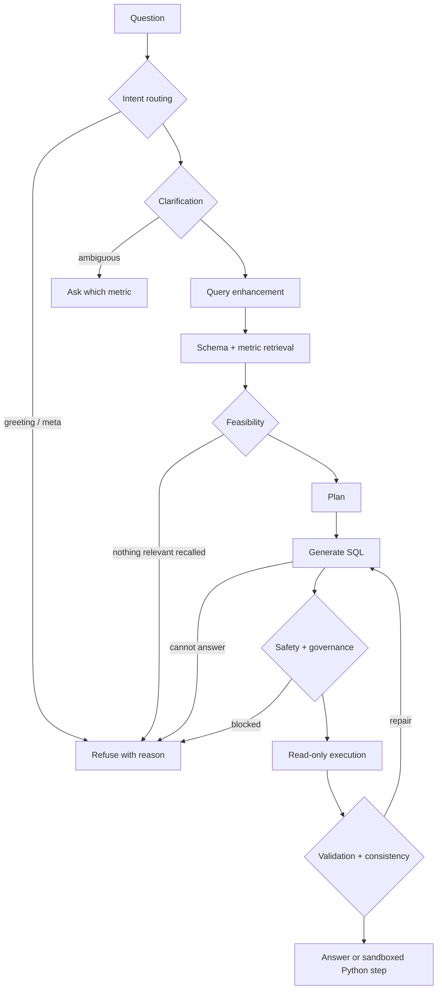

# Cadence — reliability-first NL-to-SQL agent

[](https://github.com/niguang220/cadence/actions/workflows/ci.yml)

Cadence is a Python/LangGraph data agent for answering questions over a governed SaaS
database. It combines model-generated SQL with deterministic safety, governance, bounded
repair, and an evaluation harness that measures both improvements and regressions.

This repository is an engineering testbed, not a production analytics platform. Its current
focus is a narrower question: **how can an NL-to-SQL system expose and measure the ways it can
return a convincing but wrong number?**

## Try it

```bash
python -m venv .venv
source .venv/bin/activate
pip install -e ".[dev]"

# No LLM or API key. The embedding model may download on first use.
cadence retrieve "revenue by plan"

# Full agent. Requires DEEPSEEK_API_KEY. Semantic governance is on by default.
cadence ask "How many active subscriptions do we have per region?"

# Service-free test suite.
pytest -q
```

For the Streamlit demo:

```bash
pip install -e ".[demo]"
streamlit run demo/app.py
```

The demo shows the generated SQL, execution result, pipeline trace, usage, governance
decisions, and semantic-layer ON/OFF comparison. It runs the real agent; the answers are not
hard-coded. It reports four distinct outcomes — answered, needs clarification, refused, and
blocked by governance — and shows the pipeline trace for all of them. It runs one
non-interactive turn per question and does not offer clarification resume.

The original module form remains compatible:

```bash
python -m agent "How many active subscriptions do we have per region?"
python -m agent --retrieval-only "revenue by plan"
```

## What is implemented

- A bounded LangGraph workflow for intent routing, clarification, schema retrieval, planning,
  SQL generation, execution, validation, repair, and optional Python analysis.
- Read-only SQL enforcement with both AST checks and a SQLite authorizer.
- PII handling in two layers: columns marked PII are withheld from the schema rendered to the
  model — including via the `get_schema` tool — so the default path normally cannot write a query
  naming one. Column-level SQL and result governance sit behind that as defence in depth, routed
  so blocked data cannot reach later LLM or Python stages.
- A Docker sandbox for generated Python analysis.
- A governed metric registry for definitions such as MRR and active users.
- Lexical (BM25) and in-memory dense retrieval channels behind typed contracts, fused by
  Weighted RRF on the default path; an Elasticsearch-backed value channel behind the same
  contracts, opt-in.
- Deterministic and real-API evaluation tiers with frozen fixtures, per-run provenance, paired
  controls, and failure attribution.

The default runtime and CLI use `RetrievalConfig.default()` — the `governed_rrf` preset: a
BM25 lexical channel and an in-memory dense channel, typed aggregation, Weighted RRF fusion,
deterministic Top-K selection, governed protected anchors when the semantic layer is on, and
shortest-path relation planning. Semantic governance is on by default; pass
`--no-semantic-layer` (CLI) or `semantic_layer=False` (Python) to opt out.

The lexical backend and the RRF channel weights were chosen by a deterministic, service-free
matrix over `{hand-weighted, BM25} x {0.25, 0.5, 1.0}` lexical weight. On the frozen selection
surfaces the six cells were indistinguishable, so the rule fell back to the standard external
BM25 implementation at the neutral equal weighting rather than fitting a weight to a surface
that could not measure it.

Elasticsearch value retrieval remains opt-in through the `governed_rrf_value` product mode. The public
CLI intentionally exposes only the shipping default and that value-enabled mode; ablation presets
live in the evaluation drivers rather than the product surface. `cadence retrieve ... --json`
exposes the full typed retrieval result without calling an LLM.

## How a request flows


```mermaid
flowchart TD
  Q[Question] --> I{Intent routing}
  I -->|greeting / meta| R[Refuse with reason]
  I --> C{Clarification}
  C -->|ambiguous| K[Ask which metric]
  C --> E[Query enhancement]
  E --> S[Schema + metric retrieval]
  S --> F{Feasibility}
  F -->|nothing relevant recalled| R
  F --> P[Plan]
  P --> G[Generate SQL]
  G -->|cannot answer| R
  G --> A{Safety + governance}
  A -->|blocked| R
  A --> X[Read-only execution]
  X --> V{Validation + consistency}
  V -->|repair| G
  V --> O[Answer or sandboxed Python step]
```

Intent routing is a cheap deterministic guard for greetings and meta-questions, not a topic
classifier. An out-of-domain question passes it, is rewritten by query enhancement, and is
refused by the **feasibility** gate once schema retrieval comes back empty — so an off-topic
question does cost one model call before it is declined.

Model-backed stages propose interpretations, plans, SQL, consistency judgments, and Python.
Deterministic code owns the enforceable boundaries: allowed plan shapes, retry budgets,
read-only execution, governance routing, and the sandbox boundary.

The public Streamlit demo runs a single non-interactive turn. A small deterministic clarification
heuristic may ask the user to rephrase, but the demo cannot resume that turn; this is an
experimental boundary, not a headline capability. Interrupt-based clarification and plan approval
exist as tested library APIs with in-memory state.

## Current evidence

Each row answers one product question. The denominators come from different frozen fixtures, so
they should not be combined into one accuracy score.

| Product question | Measured evidence | What it supports — and what it does not |
| --- | --- | --- |
| Does metric governance reduce business-definition errors? | On the same 24 metric cases, semantic governance ON reached 101/120 execution matches versus 10/120 with it OFF; controls were 25/30 in either mode | Strong evidence for the governed metric layer on this SaaS fixture; not general NL-to-SQL accuracy |
| Does entity-value retrieval help when table and column names are insufficient? | On 10 value-sensitive cases, otherwise-matched RRF paths scored 32/50 with value evidence versus 9/50 without it; 0 PII leaks across 80 control runs | Supports the opt-in Elasticsearch channel for high-cardinality entity questions; the fixture was deliberately value-sensitive |
| Does the shipping retriever transfer beyond the repository schema? | On a frozen 30-case Spider slice, the shipping path reached 58/90 execution matches, 100% candidate recall, and 98.3% context recall | An external screening result with a custom oracle, not an official Spider leaderboard score |
| Are deterministic boundaries regression-tested? | 14/14 gate routes matched their specification; the service-free suite currently has 732 passing tests and 8 opt-in skips | Verifies coded contracts and regressions, not real-world model accuracy |

The migration experiments and negative results that led to this product shape remain in
[Project status](docs/STATUS.md) and the reviewed reliability reports. They are engineering
history, not additional runtime modes.

The cutover to the typed RRF default — the deterministic backend/weight matrix and the frozen
full-agent gate run — is recorded in the
[governed RRF cutover report](docs/reliability/2026-08-18-governed-rrf-cutover.md).

The public-benchmark screen was frozen before execution and is documented in the
[Spider preregistration](docs/reliability/2026-08-15-spider-external-preregistration.md) and
[reviewed result](docs/reliability/2026-08-15-spider-external-result.md). It uses Cadence's custom
execution oracle and should not be read as an official Spider leaderboard score.

One earlier experiment is also kept because it shows the evaluation policy in practice: two
plausible changes to the semantic-consistency judge were rejected after clean controls exposed
no benefit or a false refusal. See the
[judge-entity experiment](docs/reliability/2026-07-22-judge-entity-experiment.md).

## Run the evaluation tiers

```bash
# Deterministic, service-free, CI-enforced.
python -m evals.scorecard --tier deterministic

# Real DeepSeek + local Docker sandbox.
docker build -t cadence-sandbox:latest - < Dockerfile.sandbox
python -m evals.scorecard --tier all

# Optional real Elasticsearch integration tests.
pip install -e ".[dev,es]"
CADENCE_ES_URL=http://localhost:9200 pytest -q -m es_integration -o addopts=
```

Paid, repeated E2E drivers live under `evals/` and are manual-only in GitHub Actions. Raw JSON
artifacts are excluded from Git; reviewed Markdown conclusions are versioned.

To validate the frozen Spider data and all 30 gold queries without making model calls:

```bash
python -m evals.spider_external --spider-dir /path/to/spider_data --preflight-only
```

## Reproduce the value-retrieval path

Value ingestion is explicit and separate from querying. The CLI checks that the
schema-specific index exists before a value-enabled query, rather than creating an empty index
or silently degrading after an LLM call.

```bash
pip install -e ".[dev,es]"
cadence build-demo-db /tmp/cadence-value.db --kind value
docker compose -f docker-compose.es.yml up -d

cadence index-values \
  --db /tmp/cadence-value.db \
  --es-url http://localhost:9200

cadence retrieve \
  --db /tmp/cadence-value.db \
  --config governed_rrf_value \
  --es-url http://localhost:9200 \
  "tickets for 上海云图信息技术"
```

Add `--json` to `retrieve` or `index-values` for machine-readable output. The same `--db`,
`--config`, `--semantic-layer`, and `--es-url` options are available on `cadence ask`.

## Known boundaries

- The main fixtures use small, repository-owned SaaS schemas. The 30-case Spider screen adds an
  external check, but is too small and uses a custom oracle, so it is not population accuracy.
- Elasticsearch value retrieval requires a separately managed service and an explicit
  `index-values` ingestion step. The CLI exposes the shipping and value-enabled modes but does not start or
  operate Elasticsearch itself.
- The semantic layer governs a metric registry, not a complete declarative entity and
  relationship model.
- HITL clarification and plan approval exist as experimental library APIs (`start_agent_session` /
  `resume_agent_session`) with tests, but no public entry point drives them: the CLI and the
  Streamlit demo both run a single non-interactive turn. Their state and the runtime
  model/backend registries are in memory and intended for local use, not a distributed service.
- There is no multi-tenancy, row-level access control, warehouse identity, or schema migration
  lifecycle.

These are tracked, in priority order, in [Project status](docs/STATUS.md).

## Project structure

```text
agent/          Agent graph, safety, governance, retrieval, execution
evalharness/    Golden loaders, metrics, oracles, report aggregation
evals/          Deterministic and real-service evaluation drivers
tests/          Service-free unit and integration-style tests
demo/           Streamlit demo
docs/           Current status and reviewed reliability reports
```

## Origin and license

Cadence continues the DB-agnostic core of my earlier DataPilot project. The planner-driven
workflow, typed retrieval pipeline, Docker sandbox, governance topology, and evaluation
surfaces were developed in this repository. The graph structure was informed by the separation
of schema recall and feasibility gating in Alibaba's `spring-ai-alibaba/DataAgent`.

MIT — see [LICENSE](LICENSE).
