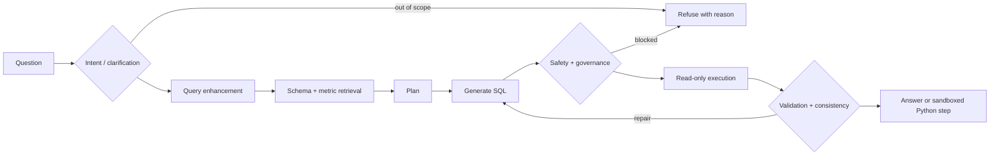

# Cadence — reliability-first NL-to-SQL agent

[](https://github.com/niguang220/cadence/actions/workflows/ci.yml)

Cadence is a Python/LangGraph data agent for answering questions over a governed SaaS
database. It combines model-generated SQL with deterministic safety, governance, bounded
repair, and an evaluation harness that measures both improvements and regressions.

This repository is an engineering testbed, not a production analytics platform. Its current
focus is a narrower question: **how can an NL-to-SQL system expose and measure the ways it can
return a convincing but wrong number?**

## Try it

```bash
python -m venv .venv
source .venv/bin/activate
pip install -e ".[dev]"

# No LLM or API key. The embedding model may download on first use.
cadence retrieve "revenue by plan"

# Full agent. Requires DEEPSEEK_API_KEY.
cadence ask --semantic-layer "How many active subscriptions do we have per region?"

# Service-free test suite.
pytest -q
```

For the Streamlit demo:

```bash
pip install -e ".[demo]"
streamlit run demo/app.py
```

The demo shows the generated SQL, execution result, pipeline trace, usage, governance
decisions, and semantic-layer ON/OFF comparison. It runs the real agent; the answers are not
hard-coded.

The original module form remains compatible:

```bash
python -m agent "How many active subscriptions do we have per region?"
python -m agent --retrieval-only "revenue by plan"
```

## What is implemented

- A bounded LangGraph workflow for intent routing, clarification, schema retrieval, planning,
  SQL generation, execution, validation, repair, and optional Python analysis.
- Read-only SQL enforcement with both AST checks and a SQLite authorizer.
- PII column and result governance, routed so blocked data cannot reach later LLM or Python
  stages.
- A Docker sandbox for generated Python analysis.
- A governed metric registry for definitions such as MRR and active users.
- Lexical, dense, and Elasticsearch-backed value-retrieval channels behind typed contracts.
- Deterministic and real-API evaluation tiers with frozen fixtures, per-run provenance, paired
  controls, and failure attribution.

The default runtime and CLI use `RetrievalConfig.current_hybrid()` (lexical + in-memory dense,
legacy min-max fusion, one-hop relations). The value channel and RRF candidate are implemented
and evaluated, but are opt-in and have **not** replaced the default.

Available CLI presets are `current_hybrid`, `lexical_baseline`, `rrf_hybrid`,
`value_ablation`, and `dense_value`. `cadence retrieve ... --json` exposes the full typed
retrieval result without calling an LLM.

## How a request flows


```mermaid
flowchart LR
  Q[Question] --> I{Intent / clarification}
  I -->|out of scope| R[Refuse with reason]
  I --> E[Query enhancement]
  E --> S[Schema + metric retrieval]
  S --> P[Plan]
  P --> G[Generate SQL]
  G --> A{Safety + governance}
  A -->|blocked| R
  A --> X[Read-only execution]
  X --> V{Validation + consistency}
  V -->|repair| G
  V --> O[Answer or sandboxed Python step]
```

Model-backed stages propose interpretations, plans, SQL, consistency judgments, and Python.
Deterministic code owns the enforceable boundaries: allowed plan shapes, retry budgets,
read-only execution, governance routing, and the sandbox boundary.

## Current evidence

The numbers below answer different questions and should not be combined into one accuracy
score.

| Evaluation | Result | Interpretation |
| --- | --- | --- |
| Deterministic gate fixture | 14/14 routes match the specification | A CI contract check (`by_construction`), not population accuracy |
| Value-sensitive E2E, 280 runs | `dense_value` 32/50 vs default 13/50; 0 PII leaks across 80 controls | Value retrieval helps the narrow cases it was designed for |
| General-mix E2E, 600 runs | Semantic ON: 101/120 vs 93/120; OFF: 10/120 vs 13/120 | Aggregate lift is mixed with case-level regressions; no default cutover |
| Spider screen, 180 runs | `rrf_hybrid` 56/90 vs default 55/90, but lower context recall and 3 extra `no_sql` outcomes | Preregistered cutover gate failed; default unchanged |

The value-sensitive comparison is documented in the
[Stage 3B report](docs/reliability/2026-08-11-stage3b-current-hybrid-headtohead.md).
The latest consolidated interpretation, including the general-mix run and open problems, is
in [Project status](docs/STATUS.md).

The public-benchmark screen was frozen before execution and is documented in the
[Spider preregistration](docs/reliability/2026-08-15-spider-external-preregistration.md) and
[reviewed result](docs/reliability/2026-08-15-spider-external-result.md). It uses Cadence's custom
execution oracle and should not be read as an official Spider leaderboard score.

One earlier experiment is also kept because it shows the evaluation policy in practice: two
plausible changes to the semantic-consistency judge were rejected after clean controls exposed
no benefit or a false refusal. See the
[judge-entity experiment](docs/reliability/2026-07-22-judge-entity-experiment.md).

## Run the evaluation tiers

```bash
# Deterministic, service-free, CI-enforced.
python -m evals.scorecard --tier deterministic

# Real DeepSeek + local Docker sandbox.
docker build -t cadence-sandbox:latest - < Dockerfile.sandbox
python -m evals.scorecard --tier all

# Optional real Elasticsearch integration tests.
pip install -e ".[dev,es]"
CADENCE_ES_URL=http://localhost:9200 pytest -q -m es_integration -o addopts=
```

Paid, repeated E2E drivers live under `evals/` and are manual-only in GitHub Actions. Raw JSON
artifacts are excluded from Git; reviewed Markdown conclusions are versioned.

To validate the frozen Spider data and all 30 gold queries without making model calls:

```bash
python -m evals.spider_external --spider-dir /path/to/spider_data --preflight-only
```

## Reproduce the value-retrieval path

Value ingestion is explicit and separate from querying. The CLI checks that the
schema-specific index exists before a value-enabled query, rather than creating an empty index
or silently degrading after an LLM call.

```bash
pip install -e ".[dev,es]"
cadence build-demo-db /tmp/cadence-value.db --kind value
docker compose -f docker-compose.es.yml up -d

cadence index-values \
  --db /tmp/cadence-value.db \
  --es-url http://localhost:9200

cadence retrieve \
  --db /tmp/cadence-value.db \
  --config dense_value \
  --es-url http://localhost:9200 \
  "tickets for 上海云图信息技术"
```

Add `--json` to `retrieve` or `index-values` for machine-readable output. The same `--db`,
`--config`, `--semantic-layer`, and `--es-url` options are available on `cadence ask`.

## Known boundaries

- The main fixtures use small, repository-owned SaaS schemas. The 30-case Spider screen adds an
  external check, but is too small and uses a custom oracle, so it is not population accuracy.
- Elasticsearch value retrieval requires a separately managed service and an explicit
  `index-values` ingestion step. The CLI exposes the evaluated presets but does not start or
  operate Elasticsearch itself.
- The semantic layer governs a metric registry, not yet a complete declarative entity and
  relationship model.
- HITL state and runtime model/backend registries are in memory and intended for the local
  demo, not a distributed service.
- There is no multi-tenancy, row-level access control, warehouse identity, or schema migration
  lifecycle.

These are tracked, in priority order, in [Project status](docs/STATUS.md).

## Project structure

```text
agent/          Agent graph, safety, governance, retrieval, execution
evalharness/    Golden loaders, metrics, oracles, report aggregation
evals/          Deterministic and real-service evaluation drivers
tests/          Service-free unit and integration-style tests
demo/           Streamlit demo
docs/           Current status and reviewed reliability reports
```

## Origin and license

Cadence continues the DB-agnostic core of my earlier DataPilot project. The planner-driven
workflow, typed retrieval pipeline, Docker sandbox, governance topology, and evaluation
surfaces were developed in this repository. The graph structure was informed by the separation
of schema recall and feasibility gating in Alibaba's `spring-ai-alibaba/DataAgent`.

MIT — see [LICENSE](LICENSE).
